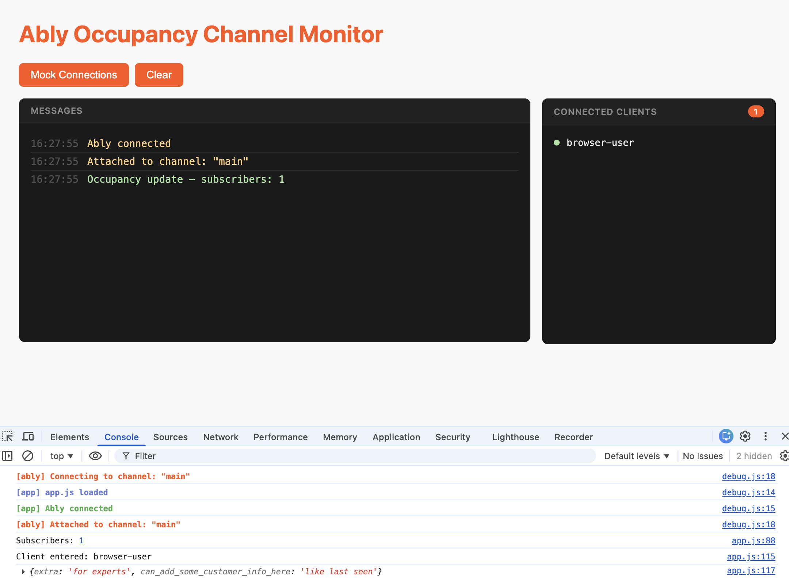

# Simple Occupancy Demo using [Ably](https://ably.com/docs/presence-occupancy)

A no-frills demo using Ably occupancy and presence, with the ablity to mock clients.  
Clients are closed after n seconds. 
Authentication into Ably uses JWT tokens. 
Inlcudes an endpoint to make a REST API request without using realtime.

## @todo

> configure webhook to capture event driven notifcations from Ably regarding channel (occupancy specific) changes.

### Outputs to screen

- connections/subscribers
- usess presence to show the client ID's of the connecting client.

